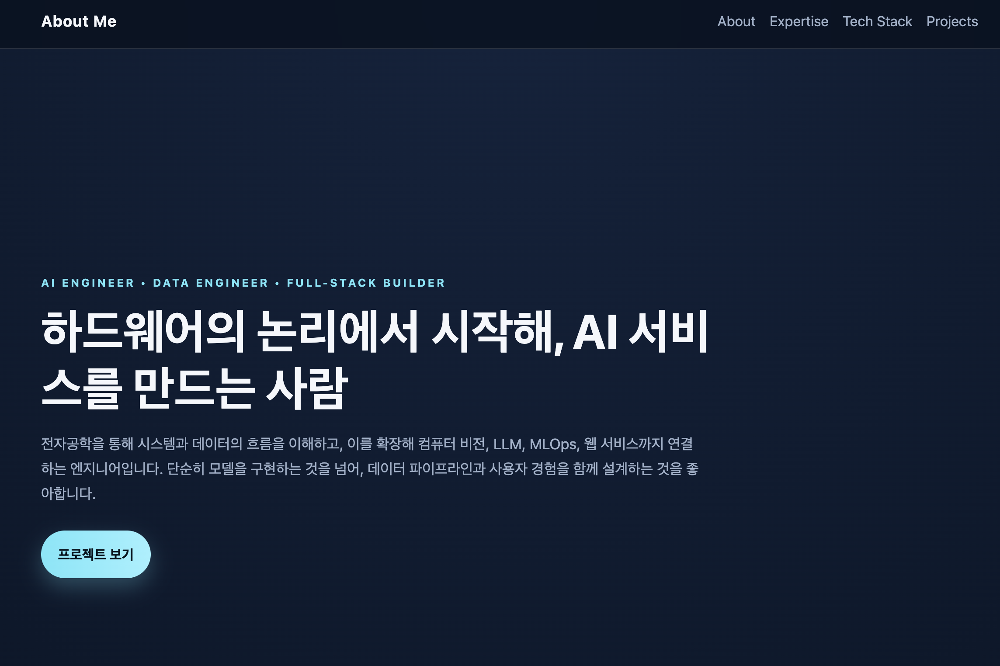
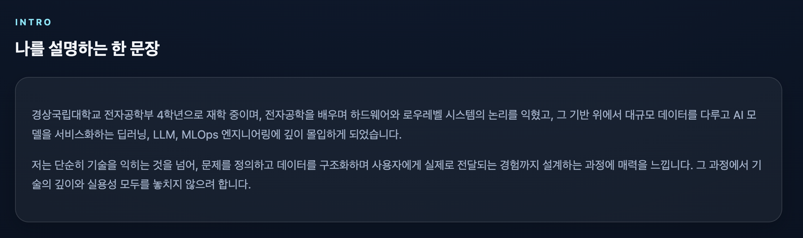
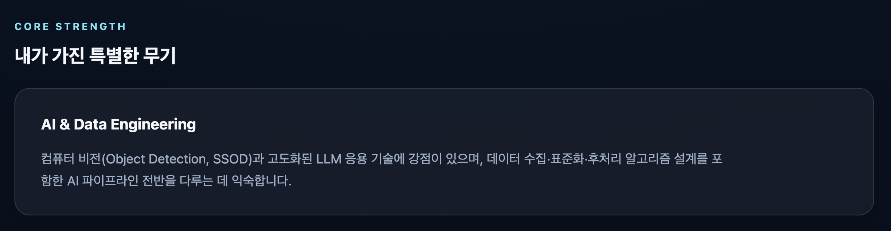
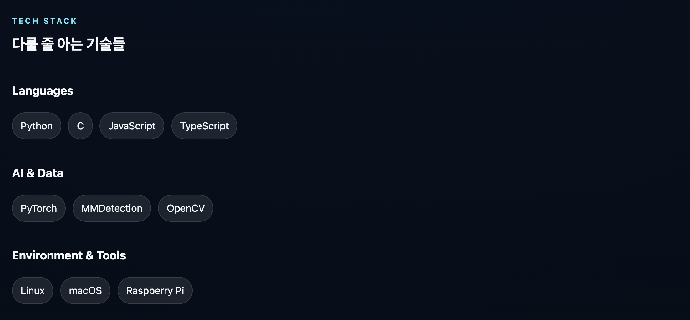
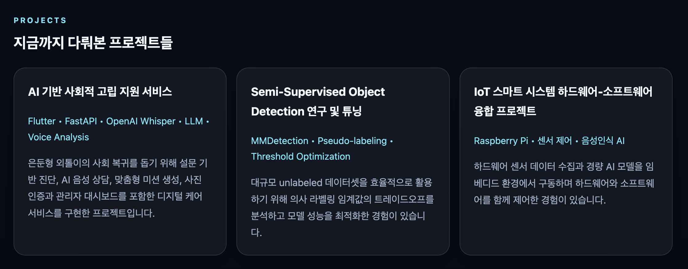

## 완료 작업 목록

| 항목 | 세부 내용 |
| --- | --- |
| `index.html` 작성 | 상단 네비게이션, 히어로, About, Expertise, Tech Stack, Projects 섹션을 포함한 단일 페이지 구성 |
| `style.css` 작성 | 다크 테마 배경, 반투명 카드, 글꼴 스타일, 버튼/배지 디자인, 반응형 레이아웃 정의 |
| 콘텐츠 정리 | 프로젝트 설명과 전문 역량 문장을 간결하게 다듬고 레이블/배지 형태로 정렬 |
| 레이아웃 검증 | 데스크톱 및 모바일 환경에서 카드와 그리드 레이아웃이 안정적으로 보이도록 조정 |
| 로컬 실행 테스트 | `python3 -m http.server`로 페이지를 실행하여 브라우저 렌더링 확인 |

## 페이지 사진

### Main 페이지

### Intro 페이지

### Core Strength 페이지

### Tech Stack 페이지

### Projects 페이지

## 설계 설계 과정

1. 요구사항 분석
   - 사용자 요구에 따라 `About`, `Expertise`, `Tech Stack`, `Projects` 섹션을 포함한 정적 포트폴리오 페이지 생성
   - 잔잔한 다크 테마와 카드형 레이아웃을 우선으로 설계
2. 파일 구조 결정
   - `index.html`: 페이지 콘텐츠 및 네비게이션, 각 섹션 구조 정의
   - `style.css`: 색상, 타이포그래피, 카드 스타일, 반응형 레이아웃 적용
3. 디자인 구성
   - 상단 네비게이션, 히어로 섹션, 기술 배지, 프로젝트 카드 형태로 구성
   - 다크 블루/네이비 계열 배경과 반투명 카드로 깔끔한 느낌 구현
4. 검증
   - 로컬 `python3 -m http.server 8000` 서버로 `index.html` 확인
   - HTML/CSS 렌더링 및 섹션 표시 정상 동작 확인

## AI를 활용한 부분

- AI에게 웹페이지 구조 설계를 요청하여 초기 콘텐츠 구성에 활용
- 디자인 요소 제안과 섹션 배치, 기술 스택 문구 정리를 AI와 협업으로 진행
- 수정 요구에 따라 스타일과 텍스트를 빠르게 업데이트

## 새로 알게 된 것

- 간단한 포트폴리오 페이지는 `HTML + CSS`만으로도 충분히 표현력이 강하다는 것
- CSS `grid`와 `flex`를 조합하면 반응형 섹션을 쉽게 구성할 수 있음
- 로컬 정적 서버(`python3 -m http.server`)로 빠르게 결과를 확인하는 워크플로우가 유용함
